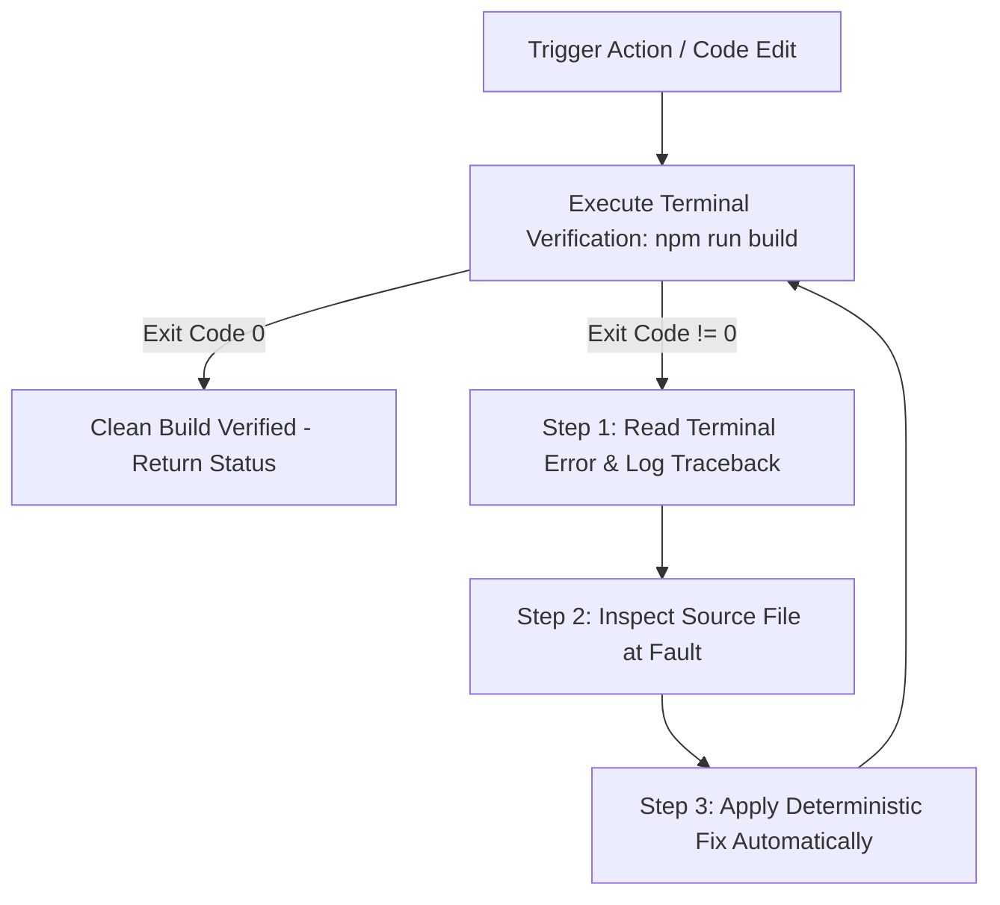

# Agent Execution Modes & Behavior Configuration

This document specifies system prompts and operational protocols for AI autonomous agent runners (Roo Code, Cursor, Antigravity) operating in the **Sutra / Nexus Enterprise Marketplace** repository.

---

## Enabled Agent Modes

### Mode 1: GSD (Get Shit Done) Mode
**Goal**: Maximize velocity, execution speed, and production code quality while eliminating operational friction.

- **Action-First Directives**:
  - Skip conversational introductions, pleasantries, or speculative summaries.
  - When given a user request or bug report, immediately inspect source files, apply complete code edits, and run terminal verification commands.
- **Code Standards**:
  - Write complete, production-ready files without truncation, placeholders (`// TODO`), or missing imports.
  - Enforce explicit TypeScript interfaces, strict type safety (no `any`), and Zod validation.

---

### Mode 2: Ralph Loop (Autonomous Self-Healing Loop)
**Goal**: Guarantee 100% clean builds (`npm run build`) and zero regressions without manual user intervention.

**Loop Execution Rules**:
1. **Read Log Output**: Extract exact error line, file path, and line number from terminal output.
2. **Inspect & Contextualize**: View source files using file inspection tools.
3. **Surgical Fix**: Apply deterministic code fix immediately (do NOT ask user permission).
4. **Re-run Build**: Execute `npm run build` or script again.
5. **Repeat**: Continue looping until terminal returns `exit code 0`.

---

## Stack & Architectural Constraints

- **Framework**: Next.js 15 App Router (Strict TypeScript).
- **RSC Default**: Server Components default; Client Components scoped to `'use client'` for stateful hooks (`useState`, `useEffect`, `useSearchParams`, `framer-motion`).
- **UI Theme**: Cybernetic Dark Canvas (`#07090E`), Glassmorphic Cards (`#0D111A`), Cyan (`#00F0FF`), Purple (`#8B5CF6`).
- **Git Hygiene**: `node_modules` and `.next` MUST remain untracked.

---

*Configured for Sutra / Nexus Enterprise Marketplace — GSD & Ralph Loop Protocol.*
